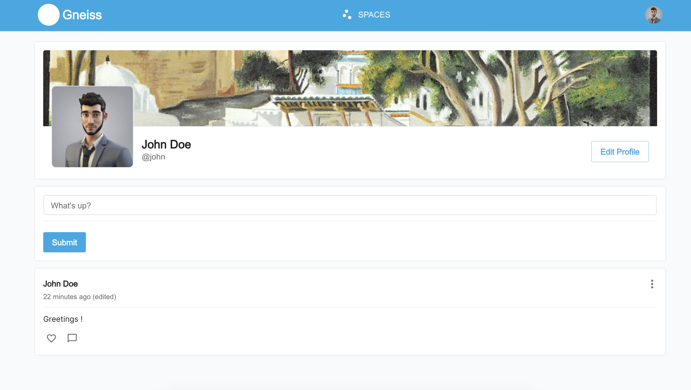

# Gneiss

Gneiss is an open-source social network kit that allows you to build your own private social network.

---

## Features

* **Posts**:  Create, edit, delete posts
* **Likes**: Like/unlike posts
* **Comments**: Create and delete comments on posts
* **User management**:  Sign in, sign up, sign out

### TODO

* **User management**:  request reset password, reset password, account settings
* **Profile**: User profile
* **Wall**: Display posts on user wall
* **Notifications**: Display internal and email notifications
* **Spaces**: Dedicated place for a subset of users to connect and share privately
* **Follow**: User can follow another user
* **Invite**: User can invite another user to join the network
* **Mentioning**: User can mention another user in a post or a comment
* **Activity**: Display activities of users  
* **Files and photos management**: Add ability to upload and display images and files

## License

MIT License
